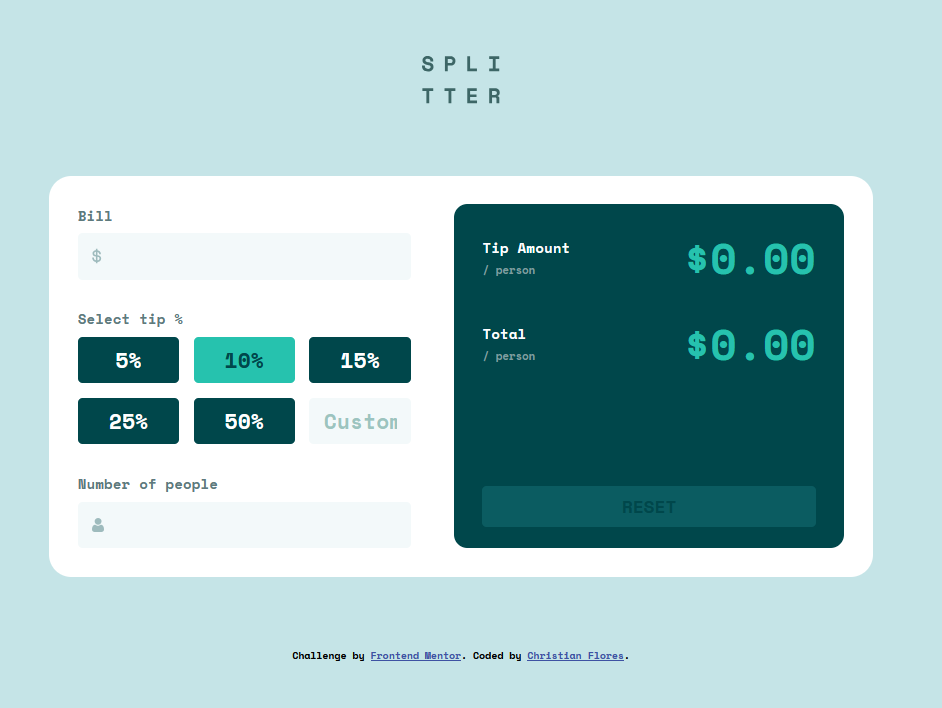
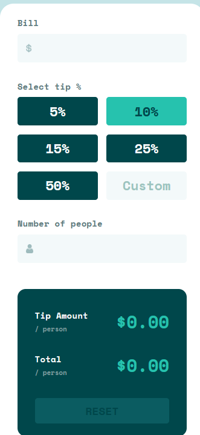

# Tip calculator app

A very simple and responsive web app that helps users calculate how much tip to leave and how much each person should pay when splitting a bill.

## Practice and reinforce:
- Responsive design
- DOM manipulation
- Clean and maintanable code
- Input form validations

## Technologies:
- HTML5
- CSS3
- Vanilla Javascript

## Main features:
-Allows user to input:
    -Bill Amount
    -Tip percentage
    -Number of people splitting the bill
-Displays:
    -Tip amount per person
    -Total amount per person
-Error handing for invalid or empty inputs
-Fully responsive for mobile, tablet and desktop

## How to use
1. Enter the bill amount
2. Choose a tip percentage (or enter a custom one)
3. Enter the number of people splitting the bill
4. The app will automatically display the tip per person and the total per person
5. Use the reset button to clear the fields and start over

## **Desktop preview:**

## **Mobile preview:**

## Live site url:
https://cftipcalcapp.netlify.app/